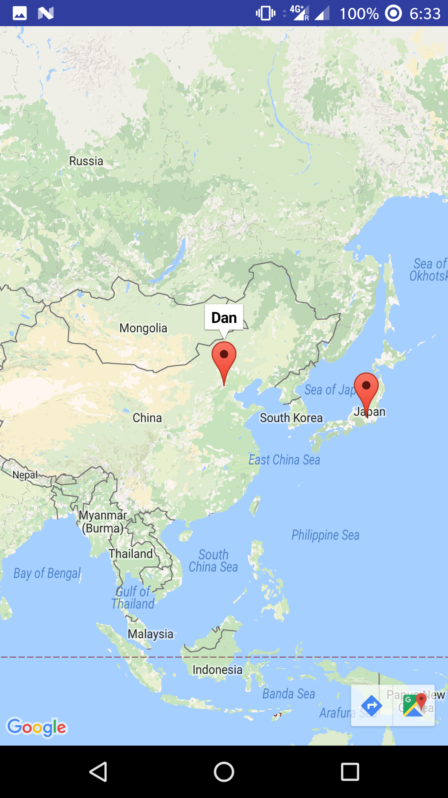
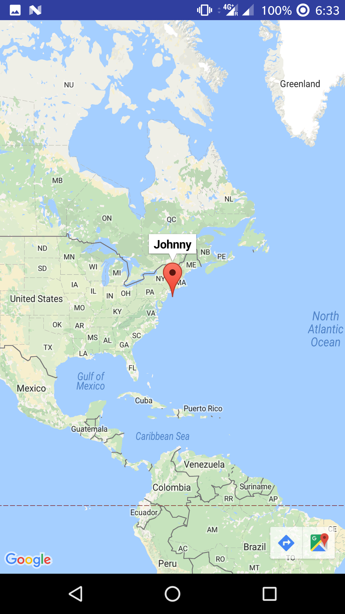
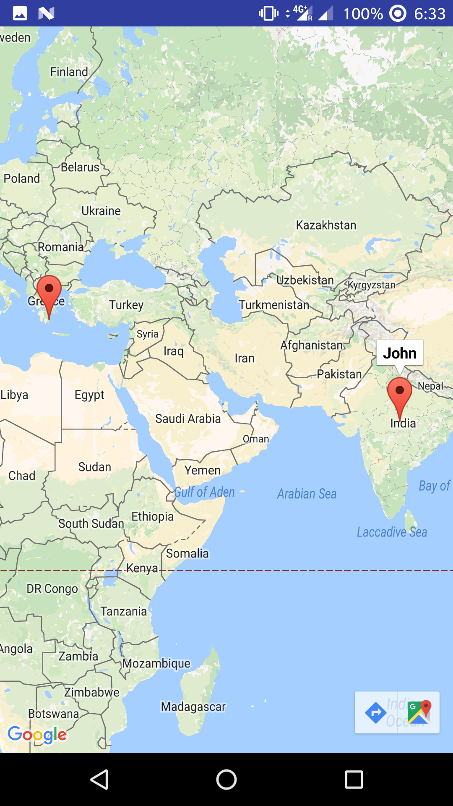

# ContactsMap [

This repository contains the source code for the showing contacts on Map (Part 1).

This app is created for an assignment of Programmable and Embedded Systems.

This app was built using [Android Studio 3.0](https://developer.android.com/studio/preview/index.html) and Gradle 4.1

Ph No. +91-7076607344

## Screenshot:

## Author

**Manne Naga Nithin** - [nithinmanne](https://github.com/nithinmanne)

14EE10026

Ph No. +91-7076607344

## License

* [Apache Version 2.0](http://www.apache.org/licenses/LICENSE-2.0.html)
